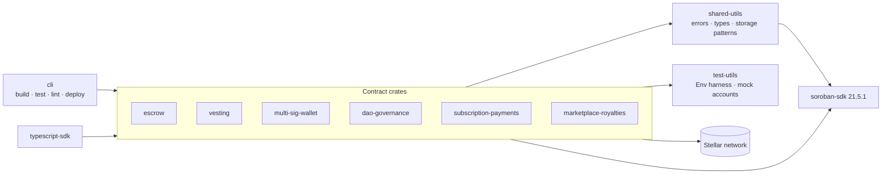
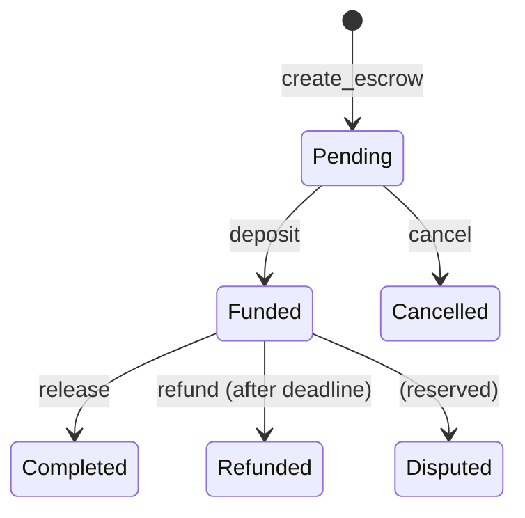

# Soroban Forge

[](LICENSE)
[](https://github.com/Meet-hybrid/soroban-forge/actions)
[](https://www.rust-lang.org)
[](https://github.com/Meet-hybrid/soroban-forge/blob/main/.github/workflows/ci.yml)

**Soroban Forge** is a community-driven library of reusable Soroban smart-contract
foundations and developer tooling for the Stellar ecosystem — escrow, vesting,
multi-signature wallets, DAO governance, subscription payments, and marketplace
royalties, plus a developer CLI and TypeScript bindings.

The goal is simple: stop rewriting the same contracts for every project. Pick a
well-documented foundation, audit it for your use case, and ship.

> **Status:** This project is under active development. The contracts are **not
> independently audited** and should not be treated as production-ready without
> your own security review. The escrow and vesting contracts are implemented
> and tested; the remaining contracts currently ship their public interfaces
> and storage types, with implementations delivered through the
> [issue backlog](docs/maintainers/issue-backlog.md).

## Contracts

| Contract | Description | Status |
|----------|-------------|--------|
| **Escrow** | Buyer–seller escrow with deadline-based refunds (`create → deposit → release / refund / cancel`, with `Disputed` reserved) | ✅ Implemented · 16 tests |
| **Vesting** | Time-locked token release with cliff and linear release (`create_schedule → claim / claimable`) | ✅ Implemented · 21 tests |
| **Multi-Sig Wallet** | Multi-owner wallet with configurable approval thresholds | 🚧 Interface + storage types |
| **DAO Governance** | On-chain proposals, voting, deadline enforcement, and execution | 🚧 Interface + storage types |
| **Subscription Payments** | Recurring payment plans with auto-renewal | 🚧 Interface + storage types |
| **Marketplace Royalties** | NFT/asset sales with configurable royalty distribution | 🚧 Interface + storage types |

Implementation work is tracked as scoped, labeled issues — see the
[issue backlog](docs/maintainers/issue-backlog.md).

## Architecture



The workspace is a virtual Cargo workspace: each contract is its own crate so
it can be deployed and upgraded independently, while `shared-utils` and
`test-utils` keep error handling, storage patterns, and test harnesses DRY.

### Escrow lifecycle



## Repository layout

```
soroban-forge/
├── crates/                   # Rust smart contracts and libraries
│   ├── shared-utils/         # ForgeError, storage patterns, shared types
│   ├── test-utils/           # Soroban Env test harness and mock accounts
│   ├── cli/                  # Developer CLI (build / test / lint / deploy)
│   ├── escrow/               # ✅ implemented
│   ├── vesting/              # ✅ implemented
│   ├── multi-sig-wallet/
│   ├── dao-governance/
│   ├── subscription-payments/
│   └── marketplace-royalties/
├── packages/                 # Language bindings and example apps
│   ├── typescript-sdk/       # TypeScript SDK for contract interaction
│   ├── nextjs-example/       # Next.js reference application
│   └── deployment-templates/ # Docker and deployment templates
├── docs/                     # Architecture, tutorials, best practices
├── templates/                # Contract scaffolding templates
└── scripts/                  # Maintainer tooling (labels, issue creation)
```

Tests live inside each contract crate as Soroban `Env`-based test modules and
run through `cargo test --workspace`.

## Quick Start

### 1. Prerequisites

The workspace pins **Rust 1.96.0** (see `rust-toolchain.toml`) — don't bump it
casually, the pinned soroban-sdk 21.x does not compile on newer toolchains.

```bash
rustup toolchain install 1.96.0          # rustup auto-uses the pinned toolchain
rustup target add wasm32-unknown-unknown # needed to build contracts to WASM
cargo install soroban-cli                # optional: for deployment
```

### 2. Clone and verify

```bash
git clone https://github.com/Meet-hybrid/soroban-forge.git
cd soroban-forge

cargo build --workspace --all-targets --locked   # compile everything
cargo test --workspace --all-targets --locked    # run the contract test suite
make lint                                        # fmt + clippy gates
```

### 3. Build a contract to WASM

```bash
cargo build --release --target wasm32-unknown-unknown -p soroban-forge-escrow
# → target/wasm32-unknown-unknown/release/soroban_forge_escrow.wasm
```

### 4. Use the developer CLI

```bash
cargo run -p soroban-forge-cli -- --help
cargo run -p soroban-forge-cli -- build --release
cargo run -p soroban-forge-cli -- test --package soroban-forge-escrow
```

### 5. Deploy to testnet

```bash
stellar contract deploy \
  --wasm target/wasm32-unknown-unknown/release/soroban_forge_escrow.wasm \
  --source-account <YOUR_KEYPAIR_NAME> \
  --network testnet
```

Then exercise the deployed contract with `stellar contract invoke` — e.g.
`create_escrow(buyer, seller, arbiter, amount, timeout)`, then
`deposit`, `release`, `refund`, or `cancel` per the lifecycle above.

## Development

```bash
make build         # cargo build --workspace --all-targets
make test          # cargo test --workspace --all-targets
make format        # cargo fmt --all
make lint          # cargo clippy --workspace --all-targets -- -D warnings
make audit         # cargo audit (requires cargo-audit)
make doc           # open rustdoc
```

CI (`.github/workflows/ci.yml`) enforces: **Rustfmt · Clippy (-D warnings) ·
Build · Test · Security Audit · WASM Size Check**, with `--locked` for
reproducible builds and a per-contract WASM size budget.

## Documentation

- [Getting Started](docs/tutorials/getting-started.md)
- [Writing Your First Contract](docs/tutorials/writing-your-first-contract.md)
- [Architecture](docs/architecture/index.md)
- [Contract Overview](docs/contracts/index.md)
- [Storage Patterns](docs/architecture/storage-patterns.md)
- [Smart Contract Security](docs/best-practices/smart-contract-security.md)
- [Testing Strategy](docs/best-practices/testing-strategy.md)

## Contributing

We welcome contributions! Please read [CONTRIBUTING.md](CONTRIBUTING.md) for
our code of conduct and contribution process. Contributor-facing work is
scoped as labeled issues in the [issue backlog](docs/maintainers/issue-backlog.md).

## Security

Please read [SECURITY.md](SECURITY.md) for how to report vulnerabilities.

## License

Licensed under either of

- [Apache License, Version 2.0](LICENSE-Apache)
- [MIT license](LICENSE-MIT)

at your option.

## Acknowledgments

Built for the Stellar developer community.
